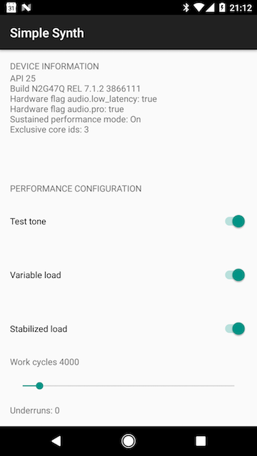

Simple Synth
===
This sample app will play a 440Hz sine wave. It demonstrates how to:

- Create a simple synthesizer which renders audio data to an OpenSL ES player
- Set thread affinity on the OpenSL ES callback to avoid CPU core migrations
- Stabilize a varying load to avoid audio glitches caused by CPU frequency scaling
- Monitor underruns in real time (API 24+ only, see below for more info)

Building
--------
- Load this project into Android Studio
- Hit the green 'Run' button to build and run Simple Synth on the Android emulator or
attached Android device (must be API 21+)

Instructions for use
--------------------
There are 4 UI controls. Here's what they do:

- Test tone: Toggles the synthesizer tone on and off
- Variable load: Varies the load (number of computations) used to render the synthesizer audio data.
Every 2 seconds the load will change from HIGH (100% of the chosen work cycles) to LOW (10% of the
chosen number of work cycles).
- Stabilized load: Only useful when variable load is on, will attempt to smooth out a varying load
- Work cycles: Allows you to set the number of computations used to render the synthesizer audio
data.

Screenshots
-----------

Notes
-----
- Real time monitoring of audio underruns is only supported on API 24+ (the `AcquireJavaProxy`
method was introduced in API 24+). If you are running this sample on an older API
you can monitor underruns by running `adb shell dumpsys media.audio_flinger`. The underrun count of
the audio output stream is shown in the `UndFrmCnt` column.

License
-------
Copyright 2017 Google, Inc.

Licensed to the Apache Software Foundation (ASF) under one or more contributor
license agreements.  See the NOTICE file distributed with this work for
additional information regarding copyright ownership.  The ASF licenses this
file to you under the Apache License, Version 2.0 (the "License"); you may not
use this file except in compliance with the License.  You may obtain a copy of
the License at

http://www.apache.org/licenses/LICENSE-2.0

Unless required by applicable law or agreed to in writing, software
distributed under the License is distributed on an "AS IS" BASIS, WITHOUT
WARRANTIES OR CONDITIONS OF ANY KIND, either express or implied.  See the
License for the specific language governing permissions and limitations under
the License.
