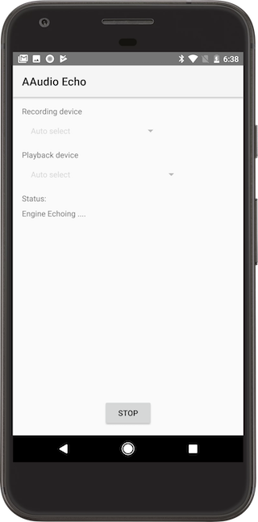

AAudio Sample
==============
These samples demonstrate how to use the AAudio API:

1. hello-aaudio: creates an output (playback) stream and plays a
sine wave when you tap the screen
1. echo: creates input (recording) and output (playback) streams,
then "echos" the recorded audio to the playback stream.

[Official AAudio documentation](https://developer.android.com/ndk/guides/audio/aaudio/aaudio.html)

Pre-requisites
-------------
* Android Device with recording capability
* [Android O DP3](https://android-developers.googleblog.com/2017/06/android-o-apis-are-final-get-your-apps.html) (Developer's Preivew) API (android-26) and above
* [NDK-r15](https://developer.android.com/ndk/downloads/index.html) or above
* [Android Studio 2.3.0+](https://developer.android.com/studio/index.html)

Getting Started
---------------
1. [Install Android Studio](https://developer.android.com/studio/index.html)
1. Clone this sample repository
1. Import the sample project into Android Studio
    - File -> New -> Import Project
    - Browse to aaudio/build.gradle
    - Click "OK"
1. Click Run -> Run, choose the sample you wish to run

Screenshots
-----------

Support
-------
If you've found an error in these samples, please [file an issue](https://github.com/googlesamples/android-audio-high-performance/issues/new).

Patches are encouraged, and may be submitted by [forking this project](https://github.com/googlesamples/android-audio-high-performance/fork) and
submitting a pull request through GitHub. Please see [CONTRIBUTING.md](../CONTRIBUTING.md) for more details.

- [Stack Overflow](http://stackoverflow.com/questions/tagged/android-ndk)
- [Google+ Community](https://plus.google.com/communities/105153134372062985968)
- [Android Tools Feedback](http://tools.android.com/feedback)

License
-------
Copyright 2017 Google, Inc.

Licensed to the Apache Software Foundation (ASF) under one or more contributor
license agreements.  See the NOTICE file distributed with this work for
additional information regarding copyright ownership.  The ASF licenses this
file to you under the Apache License, Version 2.0 (the "License"); you may not
use this file except in compliance with the License.  You may obtain a copy of
the License at

http://www.apache.org/licenses/LICENSE-2.0

Unless required by applicable law or agreed to in writing, software
distributed under the License is distributed on an "AS IS" BASIS, WITHOUT
WARRANTIES OR CONDITIONS OF ANY KIND, either express or implied.  See the
License for the specific language governing permissions and limitations under
the License.

Version History
---------------
1. 22nd March 2017: Initial release for Android - O DP1. Directly reading & writing to audio streams
2. 17th May 2017: Updated for Android-O-DP2 release, using AAudio callback interface
3. 3rd July 2017: Allow different audio devices (e.g. USB headphones) to be selected and handle stream disconnection
